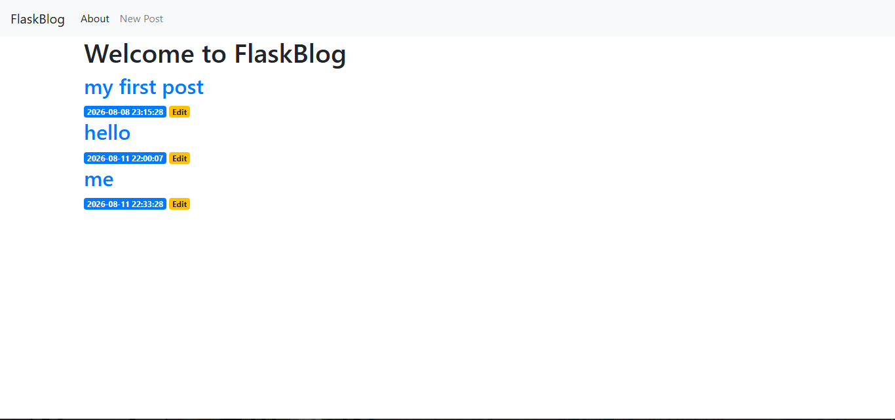
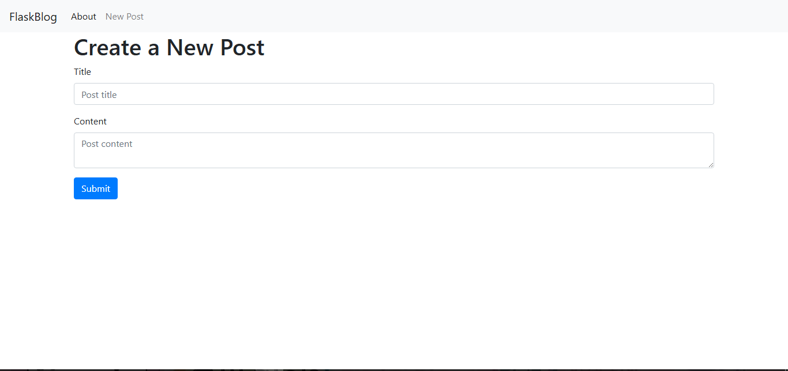
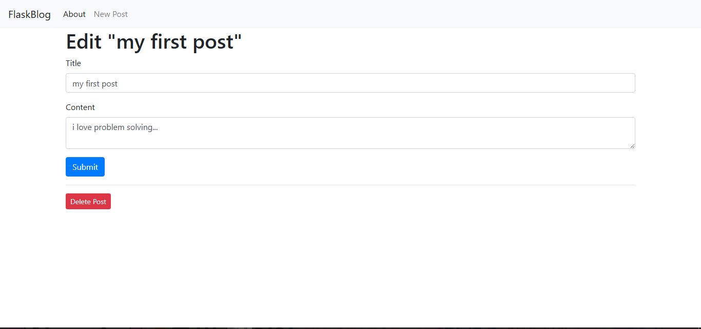

# 📝 Flask Blog Application

A lightweight, dynamic web application built with Flask and SQLite, allowing users to create, read, update, and delete blog posts. This project demonstrates core full-stack web development concepts including database management, CRUD operations, and template inheritance.

## 🚀 Features

- **Create a Post**: Add new blog posts with a title and content.
- **Read Posts**: View a list of all posts on the homepage and individual posts on dedicated pages.
- **Update a Post**: Edit the title or content of existing posts.
- **Delete a Post**: Remove unwanted posts from the database.
- **User Feedback**: Real-time flash messages for successful actions and error handling.
- **Responsive Design**: Clean UI built with Bootstrap 4, ensuring the site looks great on mobile and desktop.
### 📸 Screenshots

**Homepage:**


**Create new Post in the Form:**

**Edit and Delete a Post :**

## 🛠️ Tech Stack

- **Backend**: Python, Flask
- **Database**: SQLite3 (using `sqlite3` module)
- **Frontend**: HTML5, Jinja2 templating, Bootstrap 4, CSS3
- **Version Control**: Git

## 📂 Project Structure

```text
flask-blog/
├── app.py                  # Main Flask application logic
├── .env                    # Environment variables (Secret Key)
├── .gitignore              # Files ignored by Git
├── posts_db.db             # SQLite database file (ignored by Git)
├── templates/              # HTML/Jinja2 templates
│   ├── base.html           # Base template with navbar and footer
│   ├── index.html          # Homepage displaying all posts
│   ├── create.html         # Form for creating/editing posts
│   └── post.html           # Single post view
└── README.md               # Project documentation
```
## ⚙️ Installation & Setup

Follow these steps to get the application running on your local machine.

### Prerequisites
Make sure you have the following installed on your system:
- **Python** (Version 3.7 or higher). You can check by running `python --version` in your terminal.
- **Git** (Optional, for cloning the repository).

### Step 1: Clone the repository (or download the ZIP)

Open your terminal (Command Prompt, PowerShell, or Terminal) and run:

```bash
git clone https://github.com/[YOUR_USERNAME]/[REPO_NAME].git
cd [REPO_NAME]
```
### Step 2: Create and activate a virtual environment

A virtual environment keeps your project dependencies isolated from your global Python installation.

**For Windows:**
```bash
python -m venv venv
venv\Scripts\activate
```
### Step 3: Install dependencies
```bash
pip install flask python-dotenv
```
### Step 4: Set up environment variables

Environment variables are used to store sensitive information, like your app's secret key, so they stay hidden from the public.

Create a new file named `.env` in the root directory of your project (the same folder where `app.py` is located). Open this file in any text editor (like VS Code or Notepad) and add the following line:

```env
SECRET_KEY=your_secure_random_string_here
```
### Step 5: Create the database

Since the database file (`posts_db.db`) is not included in the GitHub repository, you must create it yourself locally. 

To do this, create a new Python file named `init_db.py` in the root directory of your project (right next to `app.py`).

Copy and paste the following code into `init_db.py`:

```python
import sqlite3

# Connect to the database (this will create the file if it doesn't exist)
connection = sqlite3.connect('posts_db.db')
cursor = connection.cursor()

# Create the 'posts' table
cursor.execute('''
    CREATE TABLE IF NOT EXISTS posts (
        id INTEGER PRIMARY KEY AUTOINCREMENT,
        title TEXT NOT NULL,
        content TEXT NOT NULL,
        created TIMESTAMP DEFAULT CURRENT_TIMESTAMP
    )
''')

# Insert a sample post so the blog isn't empty on the first run
cursor.execute('''
    INSERT INTO posts (title, content) 
    VALUES ('Welcome to the Blog!', 'This is your first sample post.')
''')

# Save changes and close the connection
connection.commit()
connection.close()

print("✅ Database 'posts_db.db' created successfully with a sample post!")
```
### Step 6: Run the database script

Now that you have created the `init_db.py` file, you need to execute it to actually build the database.

Make sure your virtual environment is still active (you should see `(venv)` at the beginning of your terminal prompt). Then, run the following command:

```bash
python init_db.py
```
### Step 7: Run the application

With the database successfully created, you are now ready to start the Flask development server.

In your terminal (with your virtual environment still active), run the following command:

```bash
python app.py
```
### Step 8: Access the application

Open your favorite web browser (Google Chrome, Mozilla Firefox, Microsoft Edge, Safari, etc.) and navigate to the following address:
[http://127.0.0.1:5001](http://127.0.0.1:5001)
